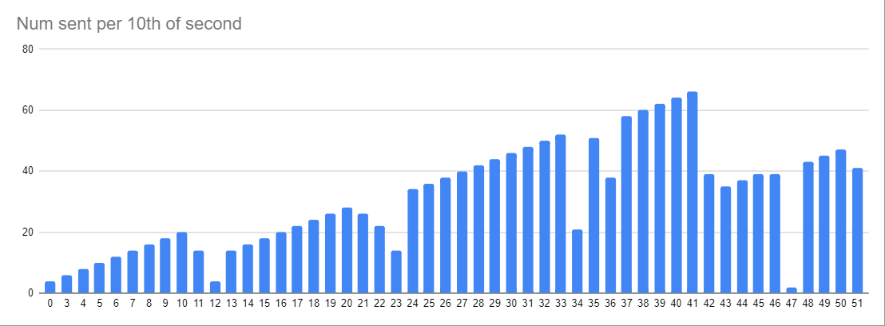

<h1>AIMD-congestion-control</h1>

This is a multithreaded utility to handle a number of callable "tasks" when downstream conditions are sensitive or unknown.

The inspiration is the Additive-Increase-Multiplicative-Decrease (AIMD) algorithm that TCP uses to avoid network congestion.
This utility could be used to the same effect with HTTP requests, but could also work with database queries or
whatever other sensitive dependencies there might be downstream.

<h2>How it works</h2>

It works by initiating _n_ worker threads, then adding new threads every time _n_ tasks are successfully completed. 
This in turn increases _n_ and the work is completed with linearly increasing speed.

This increase will continue until exceptions occur, which will rapidly decrease the number of threads. The decrease
works by entering "throttle-mode", which means no new work is accepted and all worker threads are killed. The
TaskExecutor then recovers by creating some lesser proportion of new threads to pick up where the old work-force left
off.

The reason I'm culling all worker threads instead of just killing them until only the desired count is left is tricky.
In a throttling situation there may be enough failures coming in to trigger throttling multiple times in a row. This
results in the number of threads dropping like a stone all the way to 1. It doesn't suffice to just prevent overlapping
throttling because of latent errors so culling all threads acts as a recovery period. 
I'm calling this problem "runaway-throttling."

Here's a sample run of 1500 requests sent from one service to another using my tool. The "congestion" on the server-side
was just some synthetic nonsense that started low, then increased, then decreased somewhat. That behavior is visible
from the client-side in the saw-tooth pattern of the request-rate. The graph isn't perfect but the client is clearly 
responding to changes in bandwidth.



<h2>Code Examples</h2>

Let's say we need information for a list of users but our datasource can only handle so many requests at a time.

The tasks can be configured simply like so:
```
List<Callable<String>> tasks = new ArrayList<>();
for (User user : users) {
    tasks.add(() -> getUser(user.getUserId()));
}
TaskExecutor<String> executor = new TaskExecutor<>(tasks, List.of());

try {
    List<String> responses = executor.execute();
} catch (InterruptedException e) {
    e.printStackTrace();
}
```
If a throttling situation is encountered the TaskExecutor will need to retry failed tasks. It can be configured with
"retryable" exceptions, and the tasks can be configured with finer control over how exceptions are thrown:
```
List<Callable<String>> tasks = new ArrayList<>();
for (User user : users) {
    tasks.add(() -> {
        try {
            return getUser(user.getUserId());
        } catch (WebApplicationException e) {
            if (e.getResponse().getStatus() == Response.Status.SERVICE_UNAVAILABLE.getStatusCode()) {
                throw e;
            }
            throw new Exception(e);
        }
    });
}

TaskExecutor<String> executor = new TaskExecutor<>(tasks, List.of(WebApplicationException.class));

try {
    List<String> responses = executor.execute();
} catch (InterruptedException e) {
    e.printStackTrace();
}
```
The exact behavior of the additive-increase and multiplicative-decrease can also be configured:
```
TaskExecutor<String> executor = new TaskExecutor<>(tasks, List.of(WebApplicationException.class))
        .initialCount(2) // how many threads to start with
        .throttleThreshold(5) // how many "retryable" exceptions before it decreases
        .increaseNum(2) // by how many threads to increase
        .decreaseCoefficient(0.5); // proportion of threads to target when throttling
```
When all tasks are done there are performance metrics available.
```
try {
    List<String> responses = executor.execute();
    System.out.println("Sent " + executor.getNumRequestsSent() + " requests");
    System.out.println("Failed without retry " + executor.getNumErroredWithoutRetry() + " requests");
    System.out.println("Throttled " + executor.getNumTimesThrottled() + " times");
    System.out.println("Finished " + executor.getNumFinished() + " requests");
    System.out.println("Size of responses: " + responses.size());
} catch (InterruptedException e) {
    e.printStackTrace();
}
```

<h2>Known Issues</h2>
This tool is not super stable. Multithreading is hard to debug and whenever I think I've got it stable some new issue
seems to pop up that I can't yet explain. 
- Sometimes all worker threads just stop working. They don't return, they just stop, which locks up the entire tool.
- Maybe it's just my testing setup, but it seems that if I run it enough times in a row it slows way down. Maybe I'm making too many threads?


